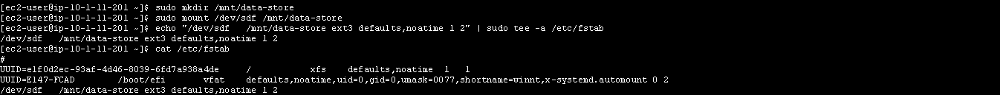

# Amazon EBS Project

**Date:** May 2025  

---

## 📌 Introduction
In this project, I worked with **Amazon Elastic Block Store (EBS)** to understand how persistent block storage integrates with **EC2 instances**.  
The lab demonstrates how to create and attach volumes, format and mount them, take snapshots, and restore data from snapshots.  

---

## 🎯 Objectives
By the end of this lab, I was able to:  
- Create a new **Amazon EBS volume**.  
- Attach and mount the volume to an EC2 instance.  
- Create a **file system** and add a test file.  
- Take a **snapshot** of the volume.  
- Create a new volume from the snapshot.  
- Attach and mount the restored volume.  
- Verify that the data persisted across the snapshot and restore process.  

📷 *EBS Overview:*  

---

## ☁️ AWS Services Used
- **Amazon EC2**  
- **Amazon EBS (Elastic Block Store)**  
- **Amazon S3 (for storing snapshots)**  

---

## 🛠️ Project Execution

### **Task 1: Create a New EBS Volume**
- Checked **Availability Zone** of the EC2 instance.  
- Created a **1 GiB gp2 volume** in the same AZ.  
- Tagged the volume as `My Volume`.  

📷 *Create EBS Volume:*  

> 📝 **Note:**  
> Adding a **Tag** with `Key: Name` and `Value: My Volume` helps organize and identify the volume easily in the AWS Console.  
> It also makes cost tracking and automation easier when managing multiple resources.

---

### **Task 2: Attach the Volume**
- Attached **My Volume** to the **Lab EC2 instance**.  
- Device name: `/dev/sdf`.  

📷 *Attach Volume:*  

> 📝 **Note:**  
> Although the volume is attached as `/dev/sdf`, Linux might internally rename it to `/dev/xvdf` (or similar).  
> This is normal behavior and the volume will still function properly.

---

### **Task 3: Connect to EC2 Instance**
- Used **EC2 Instance Connect** to open a terminal.  
- Verified connection with a `$` prompt.  

📷 *EC2 Instance Connect:*  

---

### **Task 4: Configure File System**
- Verified storage using `df -h`.  
- Created **ext3 file system** on `/dev/sdf`.  
- Mounted to `/mnt/data-store`.  
- Updated `/etc/fstab` for persistent mounting.  
- Verified with `df -h`.  
- Created `file.txt` with test data and confirmed contents.  

📷 *File System Creation:*  

📷 *Mounted Volume:*  

📷 *Test File Created:*  

> 📝 **Note:**  
> If you see a folder named **`lost+found`** after formatting the volume, this is normal.  
> It’s a system folder automatically created by Linux for file recovery in case of corruption.

---

### **Task 5: Create Snapshot**
- Selected `My Volume` → **Create Snapshot**.  
- Tagged snapshot as `My Snapshot`.  
- Verified status changed from **Pending → Completed**.  
- Deleted `file.txt` from `/mnt/data-store`.  

📷 *Create Snapshot:*  

📷 *Snapshot Completed:*  

📷 *File Deleted:*  

> 📝 **Note:**  
> Snapshots are stored in **Amazon S3**, and only the used storage blocks are saved.  
> This means empty blocks don’t consume space, making snapshots efficient.

---

### **Task 6: Restore Snapshot**
- Created a new volume from `My Snapshot`.  
- Tagged as `Restored Volume`.  
- Attached to the **Lab EC2 instance** as `/dev/sdg`.  
- Mounted at `/mnt/data-store2`.  
- Verified `file.txt` exists again on restored volume.  

📷 *Restored Volume:*  

📷 *Mounted Restored Volume:*  

---

## 👩‍💻 Author
*Developed and documented by [Rawan Ramadan]*  
